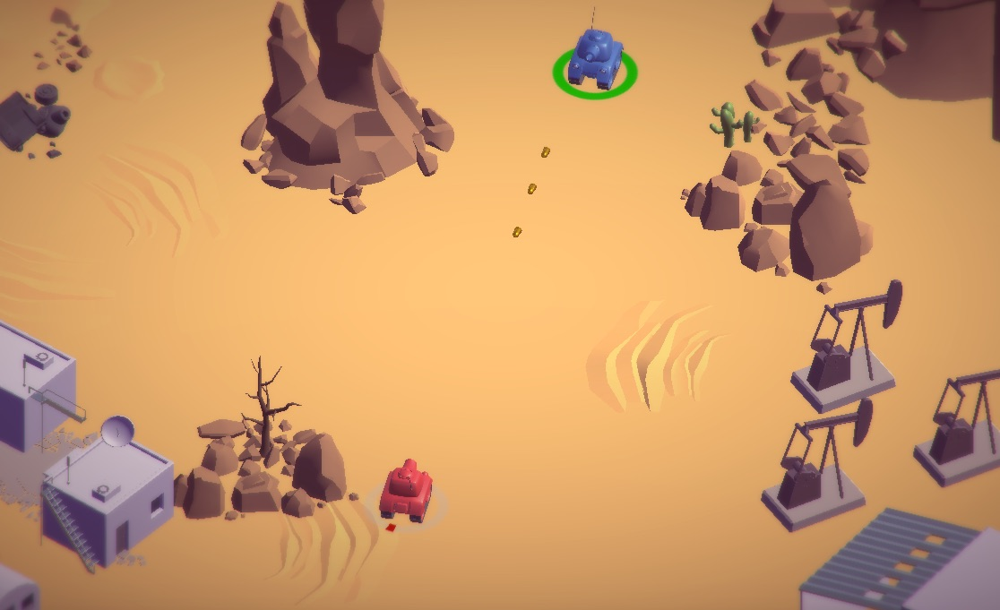

# Tanks! Demo

  <a class="btn btn-primary" href="Tanks/" role="button">Play WebAssembly</a>

  <a class="btn hide-asm-support" href="Tanks/" role="button">Play asm.js fallback</a>
  Your browser doesn't support WebAssembly yet. <a href="/roadmap/">Learn more</a>

This is a demo of [Tanks!, a Unity tutorial game](https://unity3d.com/learn/tutorials/projects/tanks-tutorial) which has been exported to WebAssembly. Drive tanks around the sandbox and shoot the enemy tank in this local multiplayer game. Blue Tank movement is controlled by W, A, S, D keys and firing by the spacebar. Red Tank movement is controlled by the arrow keys, and firing by Enter.

