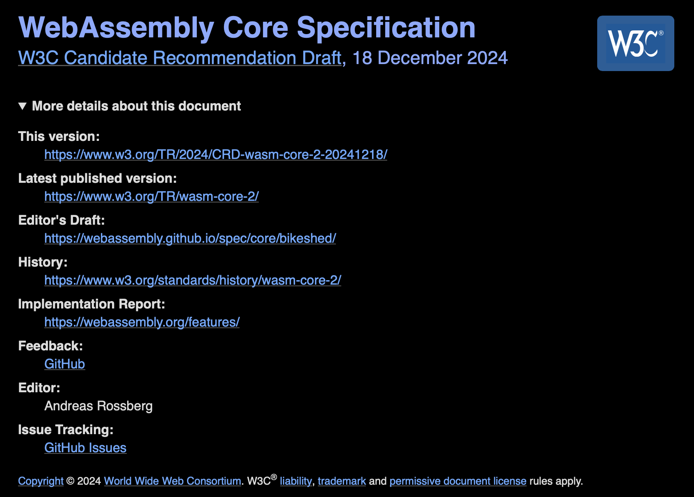

# Wasm 2.0 Completed

_Published on March 20, 2025 by [Andreas Rossberg](https://github.com/rossberg)._

As of last December, release 2.0 of the Wasm specification is “official”!

If you have been following the developments of the Wasm standard, then version 2.0 may sound like rather old news to you. And indeed, the Wasm Community and Working Groups had reached consensus and finished the specification in early 2022. All major implementations have been shipping 2.0 for even longer. But for a variety of non-technical reasons, it took a while for it to advance through the W3C process and reach the status of “Candidate Recommendation”.

With the advent of 2.0, the Working Group is switching to a so-called “evergreen” model for future releases. That means that the Candidate Recommendation will be updated in place when we create new versions of the language, without ever technically moving it to the final Recommendation state. For all intents and purposes, the latest [Candidate Recommendation Draft](https://www.w3.org/TR/wasm-core-2/) is considered to be the current standard, representing the consensus of the Community Group and Working Group. (If this sounds odd, that’s mostly because the W3C's document terminology does not quite match this more flexible process, which has recently been adopted by several working groups.)

For the most up-to-date version of the current specification, we recommend looking at the documents hosted on our [GitHub page](https://webassembly.github.io/spec/). This always includes the latest fixes and offers multiple different formats for reading and browsing.

For those who are not following the evolution of Wasm as closely, here is the summary of the additions in version 2.0 of the language:

* [*Vector instructions*](https://github.com/webassembly/simd): With a massive 236 new instructions — more than the total number Wasm had before — it now supports 128-bit wide SIMD (single instruction, multiple data) functionality of contemporary CPUs, like Intel’s SSE or ARM’s SVE. This helps speeding up certain classes of compute-intense applications like audio/video codecs, machine learning, and some cryptography.

* [*Bulk memory instructions*](https://github.com/WebAssembly/bulk-memory-operations): A set of new instructions allows faster copying and initialization of regions of memory or ranges of tables.

* [*Multi-value results*](https://github.com/WebAssembly/multi-value): Instructions, blocks, and functions can now return more than one result value, sometimes supporting faster calling conventions and avoiding indirections. In addition, block instructions now also can have inputs, enabling new program transformations.

* [*Reference types*](https://github.com/WebAssembly/reference-types): References to functions or pointers to external objects (e.g., JavaScript values) become available as opaque first-class values. Tables are repurposed as a general storage for such reference values, and new instructions allow accessing and mutating tables in Wasm code. In addition, modules now may define multiple tables of different types.

* [*Non-trapping conversions*](https://github.com/WebAssembly/nontrapping-float-to-int-conversions): Additional instructions allow the conversion from float to integer types without the risk of trapping unexpectedly.

* [*Sign extension instructions*](https://github.com/WebAssembly/sign-extension-ops): A new group of instructions allows directly extending the width of signed integer value. Previously that was only possible when reading from memory.

It goes without saying that Wasm 2.0 is fully backwards-compatible with 1.0, that is, every valid program remains valid and preserves its behaviour.

In a future post we will take a look at Wasm 3.0, which is already around the corner at this point!
